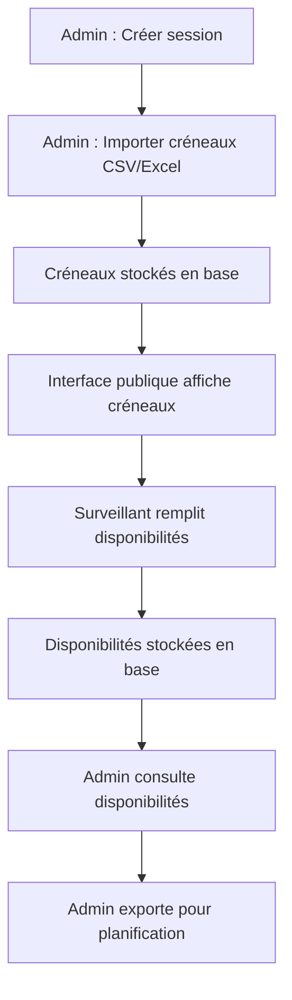
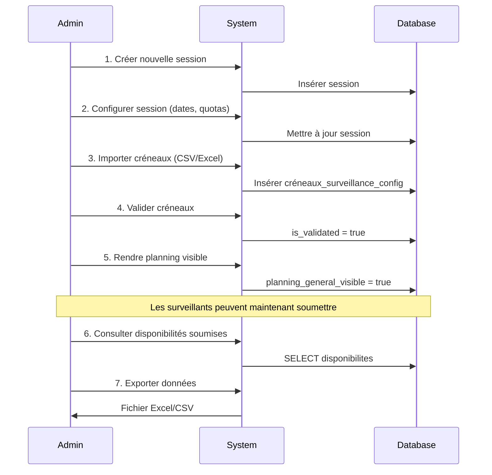
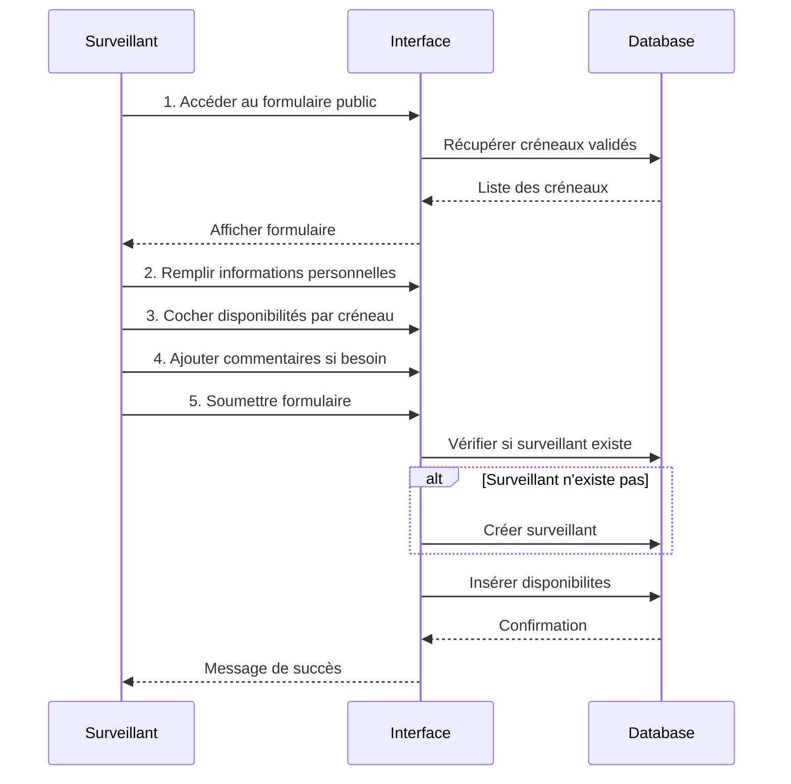

# Documentation Complète - Système de Gestion des Disponibilités pour Surveillances d'Examens

## Version Simplifiée - Sans Génération Automatique

---

## Table des Matières

1. [Vue d'ensemble](#vue-densemble)
2. [Architecture de l'application](#architecture-de-lapplication)
3. [Base de données](#base-de-données)
4. [Flux de travail](#flux-de-travail)
5. [Interface Administrateur](#interface-administrateur)
6. [Interface Publique](#interface-publique)
7. [Sécurité et authentification](#sécurité-et-authentification)
8. [Guide d'utilisation](#guide-dutilisation)

---

## 1. Vue d'ensemble

### 1.1 Objectif de l'application

L'application permet de gérer efficacement la collecte des disponibilités des surveillants pour les sessions d'examens. Elle facilite la coordination entre les administrateurs qui planifient les examens et les surveillants qui déclarent leurs disponibilités.

### 1.2 Fonctionnalités principales

#### Pour les administrateurs :
- **Gestion des sessions d'examens** : Création et configuration des périodes d'examens
- **Gestion des surveillants** : CRUD complet sur les surveillants (enseignants et personnel)
- **Import manuel des créneaux** : Upload des créneaux de surveillance via fichier Excel/CSV
- **Visualisation des disponibilités** : Consultation des disponibilités déclarées par les surveillants
- **Export des données** : Extraction des disponibilités pour planification externe
- **Gestion des enseignants** : Suivi des enseignants et de leurs besoins en surveillance

#### Pour les visiteurs/surveillants :
- **Déclaration des disponibilités** : Formulaire public pour soumettre ses disponibilités
- **Consultation des créneaux** : Visualisation des créneaux de surveillance disponibles
- **Modification de ses disponibilités** : Possibilité de mettre à jour ses informations

### 1.3 Principes de conception

- **Simplicité** : Pas de génération automatique complexe, contrôle total de l'administrateur
- **Flexibilité** : Import manuel permettant toute structure de créneaux souhaitée
- **Accessibilité** : Interface publique simple sans authentification requise pour les surveillants
- **Traçabilité** : Toutes les modifications sont enregistrées et datées

---

## 2. Architecture de l'application

### 2.1 Stack technologique

- **Frontend** : React + TypeScript + Tailwind CSS
- **Backend** : Supabase (PostgreSQL + API REST + RLS)
- **Authentification** : Supabase Auth (pour les administrateurs uniquement)
- **Stockage** : PostgreSQL via Supabase

### 2.2 Structure des modules

```
Application
├── Module Administrateur (authentifié)
│   ├── Gestion des sessions
│   ├── Gestion des surveillants
│   ├── Import des créneaux
│   ├── Consultation des disponibilités
│   └── Export des données
│
└── Module Public (sans authentification)
    ├── Visualisation des créneaux
    ├── Formulaire de disponibilités
    └── Demande de modification
```

### 2.3 Flux de données



---

## 3. Base de données

### 3.1 Tables principales

#### Table : `sessions`
Représente une période d'examens (ex: Janvier 2025, Juin 2025)

| Colonne | Type | Description |
|---------|------|-------------|
| `id` | UUID | Identifiant unique |
| `name` | TEXT | Nom de la session (ex: "Janvier 2025") |
| `year` | INTEGER | Année |
| `period` | INTEGER | Période (1 = Janvier, 2 = Juin, 3 = Septembre) |
| `is_active` | BOOLEAN | Session active ou non |
| `planning_general_visible` | BOOLEAN | Les créneaux sont-ils visibles au public |
| `created_at` | TIMESTAMP | Date de création |
| `updated_at` | TIMESTAMP | Date de dernière modification |

**Points clés** :
- Une seule session peut être active à la fois
- `planning_general_visible` contrôle si les surveillants peuvent voir et remplir les disponibilités

#### Table : `surveillants`
Gère tous les surveillants (enseignants et personnel)

| Colonne | Type | Description |
|---------|------|-------------|
| `id` | UUID | Identifiant unique |
| `nom` | TEXT | Nom de famille |
| `prenom` | TEXT | Prénom |
| `email` | TEXT | Email (unique) |
| `telephone` | TEXT | Téléphone fixe |
| `telephone_gsm` | TEXT | Téléphone mobile |
| `type` | TEXT | Type : 'enseignant', 'jobiste', 'scientifique', 'admin_technique' |
| `statut` | TEXT | Statut : 'actif', 'inactif' |
| `eft` | NUMERIC | Équivalent temps plein |
| `campus` | TEXT | Campus d'affectation |
| `affectation_fac` | TEXT | Faculté d'affectation |
| `faculte_interdite` | TEXT | Faculté où ne peut pas surveiller |
| `date_fin_contrat` | DATE | Date de fin de contrat |
| `surveillances_a_deduire` | INTEGER | Nombre de surveillances à déduire du quota |
| `created_at` | TIMESTAMP | Date de création |
| `updated_at` | TIMESTAMP | Date de dernière modification |

**Points clés** :
- L'email est unique et sert d'identifiant
- Le `type` détermine la catégorie de surveillant
- Les jobistes ont des règles spécifiques

#### Table : `surveillant_sessions`
Lie un surveillant à une session avec ses paramètres spécifiques

| Colonne | Type | Description |
|---------|------|-------------|
| `id` | UUID | Identifiant unique |
| `surveillant_id` | UUID | Référence vers `surveillants` |
| `session_id` | UUID | Référence vers `sessions` |
| `quota` | INTEGER | Nombre de surveillances attendues (défaut: 6) |
| `sessions_imposees` | INTEGER | Nombre de surveillances obligatoires |
| `a_obligations` | BOOLEAN | Le surveillant a-t-il des obligations |
| `is_active` | BOOLEAN | Est actif pour cette session |
| `date_desactivation` | TIMESTAMP | Date de désactivation |
| `remarques_desactivation` | TEXT | Motif de désactivation |
| `created_at` | TIMESTAMP | Date de création |
| `updated_at` | TIMESTAMP | Date de dernière modification |

**Points clés** :
- Un surveillant peut avoir des paramètres différents selon les sessions
- Le quota par défaut est de 6 surveillances
- La désactivation est traçable avec date et motif

#### Table : `creneaux_surveillance_config`
Contient les créneaux de surveillance importés manuellement par l'admin

| Colonne | Type | Description |
|---------|------|-------------|
| `id` | UUID | Identifiant unique |
| `session_id` | UUID | Référence vers `sessions` |
| `heure_debut` | TIME | Heure de début du créneau |
| `heure_fin` | TIME | Heure de fin du créneau |
| `nom_creneau` | TEXT | Nom du créneau (ex: "Matin 8h-12h") |
| `description` | TEXT | Description du créneau |
| `type_creneau` | TEXT | Type : 'manuel', 'standard', 'etendu' |
| `is_active` | BOOLEAN | Créneau actif ou non |
| `is_validated` | BOOLEAN | Créneau validé par l'admin |
| `created_by` | TEXT | Qui a créé le créneau |
| `created_at` | TIMESTAMP | Date de création |
| `updated_at` | TIMESTAMP | Date de dernière modification |

**Points clés** :
- Tous les créneaux sont créés manuellement par l'admin (import CSV/Excel)
- `type_creneau = 'manuel'` pour tous les imports administrateur
- Les créneaux doivent être validés (`is_validated = true`) pour être visibles au public

#### Table : `disponibilites`
Stocke les disponibilités déclarées par les surveillants

| Colonne | Type | Description |
|---------|------|-------------|
| `id` | UUID | Identifiant unique |
| `surveillant_id` | UUID | Référence vers `surveillants` |
| `session_id` | UUID | Référence vers `sessions` |
| `date_examen` | DATE | Date de la surveillance |
| `heure_debut` | TIME | Heure de début |
| `heure_fin` | TIME | Heure de fin |
| `est_disponible` | BOOLEAN | Disponible ou non |
| `type_choix` | TEXT | Type : 'souhaitee', 'possible', 'impossible', 'obligatoire' |
| `nom_examen_selectionne` | TEXT | Nom de l'examen si sélectionné |
| `nom_examen_obligatoire` | TEXT | Nom de l'examen obligatoire |
| `commentaire_surveillance_obligatoire` | TEXT | Commentaire sur surveillance obligatoire |
| `created_at` | TIMESTAMP | Date de création |
| `updated_at` | TIMESTAMP | Date de dernière modification |

**Points clés** :
- Un surveillant peut déclarer plusieurs types de disponibilités :
  - **souhaitee** : Préférence forte
  - **possible** : Peut surveiller si besoin
  - **impossible** : Non disponible
  - **obligatoire** : Doit surveiller son propre examen
- Les disponibilités sont liées à un créneau spécifique (date + heure)

#### Table : `indisponibilites`
Périodes d'indisponibilité prolongées des surveillants

| Colonne | Type | Description |
|---------|------|-------------|
| `id` | UUID | Identifiant unique |
| `surveillant_id` | UUID | Référence vers `surveillants` |
| `session_id` | UUID | Référence vers `sessions` |
| `date_debut` | DATE | Date de début d'indisponibilité |
| `date_fin` | DATE | Date de fin d'indisponibilité |
| `motif` | TEXT | Motif de l'indisponibilité |
| `created_at` | TIMESTAMP | Date de création |
| `updated_at` | TIMESTAMP | Date de dernière modification |

**Points clés** :
- Permet de gérer des absences prolongées (congés, formations, etc.)
- Peut être utilisé pour filtrer automatiquement les créneaux

#### Table : `demandes_modification_disponibilites`
Gère les demandes de modification après soumission

| Colonne | Type | Description |
|---------|------|-------------|
| `id` | UUID | Identifiant unique |
| `session_id` | UUID | Référence vers `sessions` |
| `email` | TEXT | Email du demandeur |
| `nom` | TEXT | Nom du demandeur |
| `prenom` | TEXT | Prénom du demandeur |
| `message` | TEXT | Message de la demande |
| `statut` | TEXT | Statut : 'EN_ATTENTE', 'TRAITE', 'REFUSE' |
| `commentaire_admin` | TEXT | Réponse de l'admin |
| `traite_par` | TEXT | Qui a traité la demande |
| `created_at` | TIMESTAMP | Date de création |
| `updated_at` | TIMESTAMP | Date de dernière modification |

**Points clés** :
- Permet aux surveillants de demander des modifications après soumission
- L'admin peut accepter ou refuser avec commentaire

#### Table : `commentaires_disponibilites`
Commentaires généraux des surveillants

| Colonne | Type | Description |
|---------|------|-------------|
| `id` | UUID | Identifiant unique |
| `session_id` | UUID | Référence vers `sessions` |
| `surveillant_id` | UUID | Référence vers `surveillants` (optionnel) |
| `email` | TEXT | Email du commentateur |
| `nom` | TEXT | Nom |
| `prenom` | TEXT | Prénom |
| `message` | TEXT | Contenu du commentaire |
| `statut` | TEXT | Statut : 'NON_LU', 'LU' |
| `lu_par` | TEXT | Qui a lu le commentaire |
| `lu_le` | TIMESTAMP | Date de lecture |
| `created_at` | TIMESTAMP | Date de création |
| `updated_at` | TIMESTAMP | Date de dernière modification |

**Points clés** :
- Permet aux surveillants de laisser des commentaires généraux
- L'admin peut marquer comme lu

### 3.2 Tables pour la gestion des enseignants

#### Table : `examens`
Stocke les examens et les besoins en surveillance

| Colonne | Type | Description |
|---------|------|-------------|
| `id` | UUID | Identifiant unique |
| `session_id` | UUID | Référence vers `sessions` |
| `date_examen` | DATE | Date de l'examen |
| `heure_debut` | TIME | Heure de début |
| `heure_fin` | TIME | Heure de fin |
| `matiere` | TEXT | Matière de l'examen |
| `salle` | TEXT | Salle de l'examen |
| `faculte` | TEXT | Faculté concernée |
| `enseignants` | TEXT | Enseignant(s) responsable(s) |
| `enseignant_email` | TEXT | Email de l'enseignant |
| `enseignant_nom` | TEXT | Nom de l'enseignant |
| `etudiants` | TEXT | Nombre ou liste d'étudiants |
| `nombre_surveillants` | INTEGER | Nombre total de surveillants requis |
| `surveillants_enseignant` | INTEGER | Surveillants fournis par l'enseignant |
| `surveillants_amenes` | INTEGER | Surveillants amenés par l'enseignant |
| `surveillants_pre_assignes` | INTEGER | Surveillants pré-assignés |
| `surveillants_a_attribuer` | INTEGER | Reste à attribuer |
| `type_requis` | TEXT | Type de surveillant requis |
| `code_examen` | TEXT | Code de l'examen |
| `statut_validation` | TEXT | Statut : 'NON_TRAITE', 'VALIDE', 'REJETE' |
| `besoins_confirmes_par_enseignant` | BOOLEAN | Enseignant a confirmé les besoins |
| `date_confirmation_enseignant` | TIMESTAMP | Date de confirmation |
| `lien_enseignant_token` | TEXT | Token pour lien enseignant |
| `token_expires_at` | TIMESTAMP | Expiration du token |
| `token_used_at` | TIMESTAMP | Date d'utilisation du token |
| `is_active` | BOOLEAN | Examen actif ou non |
| `created_at` | TIMESTAMP | Date de création |
| `updated_at` | TIMESTAMP | Date de dernière modification |

**Points clés** :
- Les enseignants peuvent confirmer leurs besoins en surveillance via un lien tokenisé
- Le calcul `surveillants_a_attribuer` est automatique
- Les examens peuvent être validés, rejetés ou en attente

#### Table : `personnes_aidantes`
Personnes amenées par l'enseignant pour aider à la surveillance

| Colonne | Type | Description |
|---------|------|-------------|
| `id` | UUID | Identifiant unique |
| `examen_id` | UUID | Référence vers `examens` |
| `nom` | TEXT | Nom de la personne |
| `prenom` | TEXT | Prénom |
| `email` | TEXT | Email |
| `est_assistant` | BOOLEAN | Est un assistant académique |
| `compte_dans_quota` | BOOLEAN | Compte dans le quota de surveillants |
| `present_sur_place` | BOOLEAN | Sera présent sur place |
| `ajoute_par` | TEXT | Qui a ajouté cette personne |
| `created_at` | TIMESTAMP | Date de création |
| `updated_at` | TIMESTAMP | Date de dernière modification |

**Points clés** :
- Permet de tracer qui aide à surveiller
- Certaines personnes peuvent ne pas compter dans le quota officiel

### 3.3 Tables de support

#### Table : `profiles`
Profils des administrateurs authentifiés

| Colonne | Type | Description |
|---------|------|-------------|
| `id` | UUID | Identifiant (lié à auth.users) |
| `email` | TEXT | Email de l'admin |
| `role` | TEXT | Rôle : 'admin' |
| `created_at` | TIMESTAMP | Date de création |
| `updated_at` | TIMESTAMP | Date de dernière modification |

#### Table : `user_roles`
Gestion fine des rôles utilisateurs

| Colonne | Type | Description |
|---------|------|-------------|
| `id` | UUID | Identifiant unique |
| `user_id` | UUID | Référence vers auth.users |
| `role` | ENUM | Rôle : 'admin', 'moderator', 'user' |
| `created_by` | UUID | Qui a créé ce rôle |
| `created_at` | TIMESTAMP | Date de création |

#### Table : `modifications_log`
Journal des modifications sensibles

| Colonne | Type | Description |
|---------|------|-------------|
| `id` | UUID | Identifiant unique |
| `session_id` | UUID | Session concernée |
| `table_name` | TEXT | Table modifiée |
| `record_id` | UUID | Enregistrement modifié |
| `action` | TEXT | Action : INSERT, UPDATE, DELETE |
| `old_values` | JSONB | Anciennes valeurs |
| `new_values` | JSONB | Nouvelles valeurs |
| `user_info` | TEXT | Qui a fait la modification |
| `created_at` | TIMESTAMP | Date de la modification |

**Points clés** :
- Trace toutes les modifications importantes
- Permet l'audit et la récupération de données

---

## 4. Flux de travail

### 4.1 Workflow administrateur



### 4.2 Workflow surveillant (public)



### 4.3 Import des créneaux (process détaillé)

**Format attendu du fichier CSV/Excel :**

```csv
Date,Heure Début,Heure Fin,Nom Créneau,Type,Description
2025-01-15,08:00,12:00,Matin Session A,standard,Session du matin - Auditoires A-E
2025-01-15,13:00,17:00,Après-midi Session A,standard,Session après-midi - Auditoires A-E
2025-01-16,08:00,12:00,Matin Session B,standard,Session du matin - Auditoires F-K
```

**Process d'import :**

1. L'admin sélectionne la session concernée
2. L'admin upload le fichier CSV/Excel
3. Le système parse le fichier et valide les données :
   - Format des heures correct
   - Dates cohérentes
   - Pas de doublons
4. Aperçu des créneaux à importer
5. Confirmation par l'admin
6. Insertion en base avec `is_validated = false`
7. L'admin vérifie et valide les créneaux un par un ou en masse

---

## 5. Interface Administrateur

### 5.1 Tableau de bord

**Vue principale :**
- Statistiques de la session active :
  - Nombre de créneaux configurés
  - Nombre de surveillants actifs
  - Nombre de disponibilités reçues
  - Taux de réponse
- Actions rapides :
  - Créer une session
  - Importer des créneaux
  - Voir les disponibilités
  - Exporter les données

### 5.2 Gestion des sessions

**Fonctionnalités :**
- Liste de toutes les sessions (actives et archivées)
- Création de nouvelle session :
  - Nom
  - Année
  - Période (Janvier/Juin/Septembre)
  - Dates de début et fin
- Activation/Désactivation d'une session
- Rendre le planning visible au public
- Duplication d'une session précédente

### 5.3 Gestion des surveillants

**Vue liste :**
- Tableau avec filtres :
  - Type (enseignant, jobiste, etc.)
  - Statut (actif, inactif)
  - Faculté
  - Campus
- Recherche par nom, email
- Actions :
  - Ajouter un surveillant
  - Modifier un surveillant
  - Désactiver un surveillant
  - Voir l'historique

**Formulaire surveillant :**
- Informations personnelles :
  - Nom, Prénom
  - Email (unique)
  - Téléphone fixe et GSM
- Informations professionnelles :
  - Type
  - Campus
  - Faculté d'affectation
  - Faculté interdite
  - EFT
  - Date fin de contrat
- Paramètres de session :
  - Quota de surveillances
  - Surveillances obligatoires
  - Surveillances à déduire

### 5.4 Import et gestion des créneaux

**Interface d'import :**
1. Sélection de la session
2. Upload du fichier (CSV/Excel)
3. Mapping des colonnes
4. Prévisualisation
5. Validation et import

**Gestion des créneaux :**
- Liste des créneaux importés
- Filtres par date, type, statut
- Actions :
  - Valider un créneau
  - Modifier un créneau
  - Supprimer un créneau
  - Valider en masse

### 5.5 Consultation des disponibilités

**Vue globale :**
- Tableau croisé :
  - Lignes : Créneaux (date + heure)
  - Colonnes : Types de disponibilité
  - Cellules : Nombre de surveillants
- Filtres :
  - Par date
  - Par type de surveillant
  - Par disponibilité (souhaitée, possible, etc.)

**Vue détaillée par créneau :**
- Liste des surveillants ayant déclaré ce créneau
- Détail de leurs disponibilités
- Commentaires associés
- Actions possibles :
  - Contacter un surveillant
  - Exporter la liste

**Vue par surveillant :**
- Nom et coordonnées
- Liste de toutes ses disponibilités
- Quota et nombre de surveillances déjà attribuées
- Commentaires généraux
- Historique des modifications

### 5.6 Gestion des enseignants

**Liste des examens :**
- Tableau des examens :
  - Date et heure
  - Matière
  - Enseignant responsable
  - Nombre de surveillants requis
  - Statut de validation
  - Besoins confirmés ou non

**Détail d'un examen :**
- Informations générales
- Enseignant responsable
- Besoins en surveillance :
  - Total requis
  - Fournis par l'enseignant
  - À attribuer
- Liste des personnes aidantes
- Historique des modifications

**Génération de liens pour enseignants :**
- Création d'un lien tokenisé par examen
- L'enseignant reçoit le lien par email
- Le lien permet de :
  - Confirmer les besoins en surveillance
  - Ajouter des personnes aidantes
  - Modifier les informations de l'examen

### 5.7 Export des données

**Formats disponibles :**
- Excel (.xlsx)
- CSV
- JSON

**Types d'exports :**
1. **Export global des disponibilités** :
   - Toutes les disponibilités de la session
   - Incluant informations surveillant + créneau + type de disponibilité

2. **Export par créneau** :
   - Liste des surveillants disponibles pour un créneau spécifique
   - Avec leurs coordonnées

3. **Export par surveillant** :
   - Vue individuelle de chaque surveillant
   - Toutes ses disponibilités
   - Ses quotas

4. **Export des examens** :
   - Liste des examens avec besoins en surveillance
   - Enseignants responsables
   - Personnes aidantes

**Contenu typique d'un export :**
```csv
Nom,Prénom,Email,Tel GSM,Type,Campus,Date,Heure Début,Heure Fin,Disponibilité,Commentaire
Dupont,Jean,jean.dupont@univ.be,+32499123456,enseignant,Mons,2025-01-15,08:00,12:00,souhaitee,
Martin,Sophie,sophie.martin@univ.be,+32477654321,scientifique,Charleroi,2025-01-15,08:00,12:00,possible,Préfère après-midi
```

---

## 6. Interface Publique

### 6.1 Page d'accueil publique

**Contenu :**
- Titre : "Déclaration de disponibilités pour surveillances d'examens"
- Message d'introduction expliquant la démarche
- Vérification si le planning est visible :
  - Si visible : Bouton "Déclarer mes disponibilités"
  - Si non visible : Message "Le planning n'est pas encore disponible"

### 6.2 Formulaire de disponibilités

**Section 1 : Informations personnelles**
- Nom (requis)
- Prénom (requis)
- Email (requis, unique)
- Téléphone GSM (optionnel)
- Type de personnel :
  - Enseignant
  - Scientifique
  - Jobiste
  - Admin/Technique

**Section 2 : Déclaration des disponibilités**
- Affichage des créneaux par date
- Pour chaque créneau :
  - Case à cocher : "Disponible"
  - Radio buttons : Type de disponibilité
    - Souhaitée (préférence forte)
    - Possible (si nécessaire)
    - Obligatoire (mon examen)
  - Champ texte : Commentaire (optionnel)

**Exemple d'affichage :**
```
┌─────────────────────────────────────────────────┐
│ Mardi 15 janvier 2025                           │
│                                                 │
│ ☐ Matin (08h00 - 12h00)                        │
│   ○ Souhaitée  ○ Possible  ○ Obligatoire       │
│   Commentaire: ___________________________     │
│                                                 │
│ ☐ Après-midi (13h00 - 17h00)                   │
│   ○ Souhaitée  ○ Possible  ○ Obligatoire       │
│   Commentaire: ___________________________     │
└─────────────────────────────────────────────────┘
```

**Section 3 : Indisponibilités prolongées**
- Possibilité d'ajouter des périodes d'indisponibilité :
  - Date de début
  - Date de fin
  - Motif

**Section 4 : Commentaires généraux**
- Zone de texte libre pour commentaires supplémentaires

**Validation :**
- Email valide et unique
- Au moins un créneau sélectionné (optionnel, peut être juste pour s'enregistrer)
- Confirmation avant soumission

**Après soumission :**
- Message de succès avec récapitulatif
- Email de confirmation (optionnel)
- Lien pour modifier ses disponibilités

### 6.3 Modification des disponibilités

**Accès :**
- Via lien dans l'email de confirmation
- Via formulaire avec email

**Fonctionnalités :**
- Voir ses disponibilités actuelles
- Modifier ses disponibilités
- Ajouter un commentaire de modification
- Créer une demande de modification si délai dépassé

### 6.4 Demande de modification

Si le surveillant souhaite modifier après la date limite :
- Formulaire de demande :
  - Email
  - Nom/Prénom
  - Message expliquant le besoin de modification
- La demande est envoyée aux administrateurs
- Le surveillant reçoit une notification quand la demande est traitée

---

## 7. Sécurité et authentification

### 7.1 Authentification

**Administrateurs :**
- Authentification via Supabase Auth
- Email + mot de passe
- Rôle stocké dans `profiles` et `user_roles`
- Session persistante avec tokens JWT

**Surveillants (public) :**
- Pas d'authentification requise
- Identification par email uniquement
- Lien tokenisé pour modification (optionnel)

### 7.2 Row-Level Security (RLS)

**Principe :**
Toutes les tables ont des politiques RLS activées pour sécuriser l'accès aux données.

**Politiques principales :**

1. **Table `sessions` :**
   - Public : Lecture des sessions actives avec `planning_general_visible = true`
   - Admin : Accès complet

2. **Table `surveillants` :**
   - Public : Aucun accès direct
   - Admin : Accès complet
   - Surveillant : Peut lire ses propres données via son email

3. **Table `creneaux_surveillance_config` :**
   - Public : Lecture des créneaux validés (`is_validated = true`) de la session active
   - Admin : Accès complet

4. **Table `disponibilites` :**
   - Public : Insertion autorisée
   - Surveillant : Peut lire/modifier ses propres disponibilités via son email
   - Admin : Accès complet

5. **Table `examens` :**
   - Public : Lecture des examens actifs de la session active
   - Admin : Accès complet
   - Enseignant : Peut modifier via token

6. **Table `demandes_modification_disponibilites` :**
   - Public : Insertion autorisée
   - Admin : Lecture et modification

7. **Tables `commentaires_disponibilites` :**
   - Public : Insertion et lecture autorisées
   - Admin : Accès complet, peut marquer comme lu

**Fonctions de sécurité :**

```sql
-- Vérifier si l'utilisateur est admin
CREATE OR REPLACE FUNCTION public.is_admin()
RETURNS BOOLEAN
LANGUAGE sql
STABLE SECURITY DEFINER
AS $$
  SELECT EXISTS (
    SELECT 1 FROM public.profiles 
    WHERE id = auth.uid() AND role = 'admin'
  );
$$;

-- Vérifier si l'email correspond au surveillant
CREATE OR REPLACE FUNCTION public.is_surveillant_email(email_to_check TEXT)
RETURNS BOOLEAN
LANGUAGE sql
STABLE SECURITY DEFINER
AS $$
  SELECT EXISTS (
    SELECT 1 FROM public.surveillants 
    WHERE email = email_to_check
  );
$$;

-- Vérifier si le token est valide
CREATE OR REPLACE FUNCTION public.is_valid_token(token_to_check TEXT)
RETURNS BOOLEAN
LANGUAGE sql
STABLE SECURITY DEFINER
AS $$
  SELECT EXISTS (
    SELECT 1 FROM public.examens 
    WHERE lien_enseignant_token = token_to_check
      AND (token_expires_at IS NULL OR token_expires_at > now())
  );
$$;
```

### 7.3 Validation des données

**Côté client (React) :**
- Utilisation de Zod pour validation des formulaires
- Messages d'erreur clairs
- Validation en temps réel

**Exemple de schéma Zod :**
```typescript
import { z } from 'zod';

const disponibiliteSchema = z.object({
  nom: z.string()
    .trim()
    .min(1, "Le nom est requis")
    .max(100, "Le nom est trop long"),
  prenom: z.string()
    .trim()
    .min(1, "Le prénom est requis")
    .max(100, "Le prénom est trop long"),
  email: z.string()
    .trim()
    .email("Email invalide")
    .max(255, "Email trop long"),
  telephone_gsm: z.string()
    .trim()
    .regex(/^(\+32|0)[0-9]{9}$/, "Format de téléphone belge invalide")
    .optional()
    .or(z.literal('')),
  type: z.enum(['enseignant', 'scientifique', 'jobiste', 'admin_technique']),
  disponibilites: z.array(z.object({
    creneau_id: z.string().uuid(),
    est_disponible: z.boolean(),
    type_choix: z.enum(['souhaitee', 'possible', 'obligatoire']).optional(),
    commentaire: z.string().max(500).optional()
  }))
});
```

**Côté serveur (PostgreSQL) :**
- Contraintes de base de données :
  - NOT NULL sur champs obligatoires
  - UNIQUE sur emails
  - CHECK constraints sur enums
  - Foreign keys avec CASCADE approprié
- Triggers pour validations complexes
- Sanitization automatique des inputs

### 7.4 Protection contre les attaques

**XSS (Cross-Site Scripting) :**
- Échappement automatique des données avec React
- Pas d'utilisation de `dangerouslySetInnerHTML`
- Validation stricte des inputs

**SQL Injection :**
- Utilisation de requêtes paramétrées via Supabase client
- Pas de concaténation SQL manuelle
- RLS comme couche de sécurité supplémentaire

**CSRF (Cross-Site Request Forgery) :**
- Tokens CSRF automatiques avec Supabase Auth
- Vérification des origines des requêtes

**Rate Limiting :**
- Limitation du nombre de soumissions par IP
- Limitation du nombre de modifications par email

**Données sensibles :**
- Pas de stockage de mots de passe côté application
- Tokens à usage unique et expiration automatique
- Logs des modifications sensibles

---

## 8. Guide d'utilisation

### 8.1 Pour l'administrateur : Mise en place d'une nouvelle session

**Étape 1 : Créer la session**
1. Se connecter à l'interface admin
2. Aller dans "Sessions"
3. Cliquer sur "Nouvelle session"
4. Remplir :
   - Nom : "Examens Janvier 2025"
   - Année : 2025
   - Période : Janvier
5. Sauvegarder
6. La session est créée mais pas encore active

**Étape 2 : Préparer les créneaux**
1. Préparer un fichier Excel/CSV avec les créneaux :
   ```
   Date, Heure Début, Heure Fin, Nom, Description
   15/01/2025, 08:00, 12:00, Matin A, Session matin auditoires A-E
   15/01/2025, 13:00, 17:00, AM A, Session après-midi auditoires A-E
   ...
   ```

**Étape 3 : Importer les créneaux**
1. Aller dans "Créneaux" > "Importer"
2. Sélectionner la session "Examens Janvier 2025"
3. Uploader le fichier
4. Vérifier le mapping des colonnes
5. Prévisualiser
6. Confirmer l'import
7. Les créneaux sont importés avec `is_validated = false`

**Étape 4 : Valider les créneaux**
1. Aller dans "Créneaux" > "Liste"
2. Filtrer par session
3. Vérifier chaque créneau
4. Cocher les créneaux corrects
5. Cliquer sur "Valider la sélection"
6. Les créneaux sont maintenant `is_validated = true`

**Étape 5 : Activer la session et rendre visible**
1. Retourner dans "Sessions"
2. Cliquer sur la session "Examens Janvier 2025"
3. Cocher "Session active"
4. Cocher "Planning visible au public"
5. Sauvegarder
6. Les surveillants peuvent maintenant accéder au formulaire

**Étape 6 : Gérer les surveillants**
1. Aller dans "Surveillants"
2. Vérifier la liste des surveillants actifs
3. Ajouter des nouveaux surveillants si nécessaire
4. Configurer leurs quotas pour la session :
   - Quota : 6 (par défaut)
   - Sessions imposées : à définir selon les obligations
5. Désactiver les surveillants qui ne sont plus disponibles

**Étape 7 : Suivre les soumissions**
1. Aller dans "Disponibilités"
2. Tableau de bord affiche :
   - Nombre de soumissions reçues
   - Taux de réponse par type de surveillant
   - Créneaux les plus demandés
3. Consulter les disponibilités par créneau ou par surveillant

**Étape 8 : Exporter pour planification**
1. Aller dans "Export"
2. Choisir "Export global des disponibilités"
3. Format Excel
4. Télécharger
5. Utiliser dans votre outil de planification externe

### 8.2 Pour le surveillant : Déclarer ses disponibilités

**Étape 1 : Accéder au formulaire**
1. Recevoir le lien du formulaire (email ou site web de l'université)
2. Cliquer sur "Déclarer mes disponibilités"

**Étape 2 : Remplir ses informations**
1. Nom : Dupont
2. Prénom : Jean
3. Email : jean.dupont@umons.ac.be
4. Téléphone GSM : +32 499 12 34 56
5. Type : Enseignant

**Étape 3 : Déclarer ses disponibilités**
Pour chaque créneau affiché :
1. Cocher si disponible
2. Choisir le type :
   - "Souhaitée" : Je préfère fortement ce créneau
   - "Possible" : Je peux si nécessaire
   - "Obligatoire" : C'est mon examen, je dois être présent
3. Ajouter un commentaire si besoin :
   - "Mon examen de Mathématiques avancées"
   - "Préfère l'après-midi si possible"

**Exemple :**
```
☑ Mardi 15 janvier - Matin (08:00-12:00)
  ● Souhaitée  ○ Possible  ○ Obligatoire
  Commentaire : "Préfère ce créneau car plus pratique"

☑ Mardi 15 janvier - Après-midi (13:00-17:00)
  ○ Souhaitée  ● Possible  ○ Obligatoire
  Commentaire : ""

☐ Mercredi 16 janvier - Matin (08:00-12:00)
```

**Étape 4 : Ajouter des indisponibilités (optionnel)**
Si absent plusieurs jours :
1. Cliquer sur "Ajouter une indisponibilité"
2. Date début : 20/01/2025
3. Date fin : 22/01/2025
4. Motif : Formation professionnelle

**Étape 5 : Commentaires généraux (optionnel)**
Zone de texte pour ajouter des informations générales :
- "Je préfère les surveillances en matinée"
- "Disponible pour des créneaux étendus si besoin"

**Étape 6 : Valider et soumettre**
1. Vérifier toutes les informations
2. Cliquer sur "Soumettre mes disponibilités"
3. Message de confirmation affiché
4. Email de confirmation reçu (avec lien pour modification)

**Étape 7 : Modifier si nécessaire**
Si besoin de modifier :
1. Utiliser le lien dans l'email
2. Ou aller sur le formulaire et entrer son email
3. Modifier les disponibilités
4. Soumettre à nouveau

**Si délai dépassé :**
1. Créer une demande de modification
2. Expliquer la raison
3. Attendre la réponse de l'admin

### 8.3 Pour l'enseignant : Confirmer les besoins en surveillance

**Étape 1 : Recevoir le lien**
1. Email automatique de l'administration
2. Sujet : "Confirmation des besoins en surveillance - [Matière]"
3. Lien unique et sécurisé (token)

**Étape 2 : Accéder au formulaire**
1. Cliquer sur le lien
2. Vérifier les informations de l'examen :
   - Date et heure
   - Matière
   - Salle
   - Nombre d'étudiants

**Étape 3 : Confirmer les besoins**
1. Nombre de surveillants requis : 3
2. Surveillants que j'amène : 1
   - Ajouter : Dr. Sophie Martin (assistant)
3. Surveillants à attribuer par l'administration : 2
4. Confirmer

**Étape 4 : Validation**
1. Message de confirmation
2. Récapitulatif des besoins
3. Contact en cas de question

---

## 9. Annexes

### 9.1 Types de données

**Types de surveillants :**
- `enseignant` : Enseignant titulaire
- `scientifique` : Personnel scientifique
- `jobiste` : Étudiant jobiste
- `admin_technique` : Personnel administratif ou technique

**Types de disponibilité :**
- `souhaitee` : Créneau fortement souhaité
- `possible` : Disponible si nécessaire
- `impossible` : Non disponible
- `obligatoire` : Doit surveiller (son propre examen)

**Statuts de session :**
- Active : `is_active = true`
- Inactive : `is_active = false`
- Planning visible : `planning_general_visible = true`

**Statuts de validation examen :**
- `NON_TRAITE` : En attente de traitement
- `VALIDE` : Examen validé
- `REJETE` : Examen rejeté ou annulé
- `NECESSITE_VALIDATION` : Nécessite une validation manuelle

### 9.2 Règles de gestion

**Quota de surveillances :**
- Par défaut : 6 surveillances par session
- Peut être modifié individuellement
- Les surveillances à déduire sont soustraites du quota

**Priorités d'attribution :**
1. Surveillances obligatoires (propre examen)
2. Surveillances souhaitées
3. Surveillances possibles

**Contraintes :**
- Un surveillant ne peut pas surveiller dans sa faculté interdite
- Un jobiste a des règles spécifiques (à définir selon l'université)
- Les indisponibilités prolongées excluent automatiquement les créneaux

### 9.3 Formules de calcul

**Surveillants à attribuer :**
```
surveillants_a_attribuer = 
  nombre_surveillants_total
  - surveillants_enseignant
  - surveillants_amenes
  - surveillants_pre_assignes
```

**Taux de réponse :**
```
taux_reponse = (nombre_reponses / nombre_surveillants_actifs) * 100
```

**Couverture par créneau :**
```
couverture = (nombre_disponibles / nombre_requis) * 100
```

### 9.4 Messages d'erreur courants

**Pour l'admin :**
- "Session déjà active" : Une seule session peut être active à la fois
- "Créneaux non validés" : Les créneaux doivent être validés avant de rendre le planning visible
- "Import en erreur" : Format du fichier incorrect ou données manquantes

**Pour le surveillant :**
- "Email déjà utilisé" : Cet email existe déjà, utiliser le lien de modification
- "Planning non disponible" : L'administration n'a pas encore ouvert le planning
- "Aucun créneau sélectionné" : Au moins un créneau doit être sélectionné

### 9.5 Maintenance et évolutions futures

**Maintenance régulière :**
- Archivage des sessions anciennes
- Nettoyage des tokens expirés
- Vérification de l'intégrité des données
- Backup quotidien de la base de données

**Évolutions possibles :**
1. **Notifications automatiques** :
   - Email aux surveillants n'ayant pas répondu
   - Rappels avant la date limite
   - Notification de modification de créneaux

2. **Statistiques avancées** :
   - Tableaux de bord interactifs
   - Graphiques de répartition
   - Prévision des besoins

3. **Optimisation de la planification** :
   - Algorithme d'attribution automatique
   - Respect des contraintes et préférences
   - Génération de planning optimisé

4. **Intégration calendrier** :
   - Export iCal pour les surveillants
   - Synchronisation avec calendriers universitaires

5. **Application mobile** :
   - App native ou PWA
   - Notifications push
   - Déclaration rapide

---

## 10. Support et contact

### 10.1 Documentation technique

Cette documentation est destinée aux administrateurs et développeurs. Pour plus d'informations techniques :
- Consulter la documentation de Supabase : https://supabase.com/docs
- Consulter la documentation de React : https://react.dev

### 10.2 Formation

**Pour les administrateurs :**
- Formation initiale de 2h sur l'utilisation de l'interface admin
- Guide rapide disponible dans l'application
- Support technique disponible

**Pour les surveillants :**
- Instructions simples sur le formulaire public
- FAQ disponible sur la page d'accueil
- Contact en cas de problème

---

## Conclusion

Ce système simplifié de gestion des disponibilités offre un contrôle total aux administrateurs tout en restant accessible pour les surveillants. L'absence de génération automatique permet une flexibilité maximale dans la définition des créneaux, adaptée aux besoins spécifiques de chaque session d'examens.

**Avantages de cette approche :**
- ✅ Simplicité de mise en œuvre
- ✅ Contrôle total de l'administrateur
- ✅ Flexibilité dans la définition des créneaux
- ✅ Interface publique accessible sans authentification
- ✅ Export facilité vers outils externes de planification
- ✅ Traçabilité complète des modifications

**Points d'attention :**
- ⚠️ L'import des créneaux doit être bien préparé
- ⚠️ La validation des créneaux est une étape cruciale
- ⚠️ Penser à communiquer le lien aux surveillants
- ⚠️ Prévoir un délai raisonnable pour les déclarations

---

**Version du document :** 1.0  
**Date :** Janvier 2025  
**Auteur :** Documentation système  
**Statut :** Version finale
